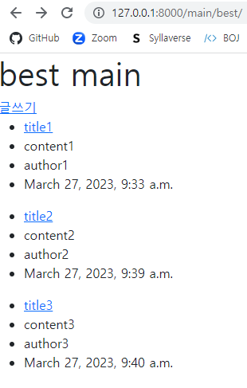
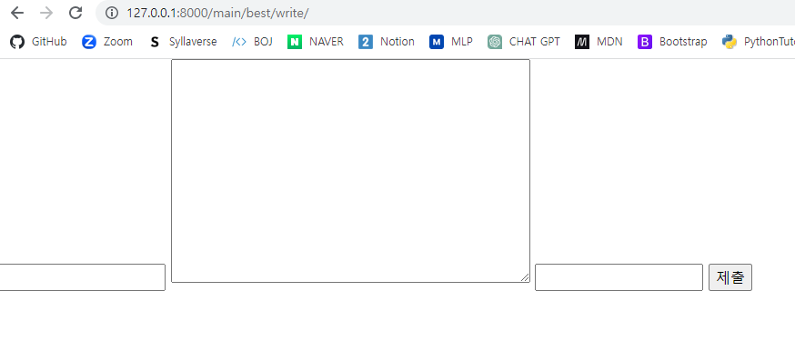
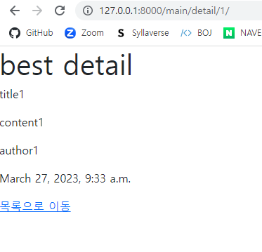

# 게시판 만들기 BASE

<br/>

## 초기 설정
- [Django Guide](../django_guide.md)

<br/>

## 프로젝트 시작
- `$ django-admin startproject bulletin .`
- `$ python manage.py startapp main`
- bulletin / settings.py
  - 앱 추가, BASE_DIR / 'templates' 설정
- templates
  - base.html, home.html 생성 및 입력

<br/>

### bulletin 프로젝트 폴더 관리
- 기본 홈페이지 생성 및 main 앱과 url 연결
  -   ```python
        # urls.py

        from django.contrib import admin
        from django.urls import path,include
        from . import views

        urlpatterns = [
            path('admin/', admin.site.urls),
            path('', views.home), # 홈 주소
            path('main/', include('main.urls')), # main 앱 주소 관리
        ]

        # views.py

        from django.shortcuts import render

        app_name = 'home'
        def home(request):
            return render(request, 'home.html') # 기본 홈 주소의 html
      ```

<br/>

### main 앱 관리
- models migrate
    - ```python
        # main/models.py

        from django.db import models

        class Post(models.Model):
            title = models.CharField(max_length=100)
            content = models.TextField()
            author = models.CharField(max_length=50)
            created_at = models.DateTimeField(auto_now_add=True)
        
        # main/admin.py

        from django.contrib import admin
        from .models import Post # 같은 경로의 models에서 Post함수를 호출

        admin.site.register(Post) # 관리자 페이지랑 연결
      ```
    - `$ python manage.py makemigrations`
    - `$ python manage.py migrate`

- `bulletin`과 연결된 url 관리
    - ```python
        # main/urls.py

        from django.urls import path
        from . import views # 같은 경로의 views를 가져옴

        app_name = 'main'
        urlpatterns = [
            path('best/', views.best, name = 'best'), # main/best/ => views.py/best함수 호출
            path('detail/<int:pk>/', views.detail, name = 'detail'), # main/best/N/ => views.py/detail함수 호출
            path('best/write/', views.write, name = 'write'), # main/best/write/ => views.py/write함수 호출
        ]
      ```

- 게시판의 `best` 페이지
    - ```python
        # main/views.py

        from django.shortcuts import render,redirect
        from .models import Post # model의 Post함수 호출

        app_name = 'main'
        def best(request):
            # Post 모델의 모든 객체를 저장, 예를 들어 첫 글의 제목이 title1이면 postlist[0].title은 title1이 됨
            postlist = Post.objects.all()
            return render(request, 'best/best.html', {'postlist':postlist})
      ```
      ```html
        <!-- main/templates/best/best.html -->

        

        
          <h1>best main</h1>
          <a href="">글쓰기</a> <!-- main/best/write/로 이동 -->
           <!-- 위에서 만든 postlist를 불러와 list라는 변수에 하나씩 넣음 -->
            <ul>
              <li>
                <!-- 작성글의 pk로 이동, 예를 들어 해당 작성글의 pk가 2면 main/detail/2/로 이동  -->
                <a href="">
                  {{list.title}} <!-- 해당 작성글의 title -->
                </a>
              </li>
              <li>{{list.content}}</li> <!-- 해당 작성글의 content -->
              <li>{{list.author}}</li> <!-- 해당 작성글의 author -->
              <li>{{list.created_at}}</li> <!-- 해당 작성글의 created_at -->
            </ul>
          
        
      ```
    
- 게시판의 `detail` 페이지
    - ```python
        # main/views.py

        def detail(request, pk): # pk도 함께 받음
        post_detail = Post.objects.get(pk=pk) # pk가 일치하는 객체를 가져와서 저장
        return render(request, 'best/detail.html', {'post':post_detail}) # 그 객체의 데이터들을 post로 저장해서 연결
      ```
    - ```html
        <!-- main/templates/best/detail.html -->
        

        
          <h1>best detail</h1>
          <p>{{post.title}}</p> <!-- 위에서 저장한 pk에 해당하는 post의 title -->
          <p>{{post.content}}</p> <!-- 위에서 저장한 pk에 해당하는 post의 content -->
          <p>{{post.author}}</p> <!-- 위에서 저장한 pk에 해당하는 post의 author -->
          <p>{{post.created_at}}</p> <!-- 위에서 저장한 pk에 해당하는 post의 created_at -->
          <a href="">목록으로 이동</a> <!-- main/best/ 로 이동 -->
        
      ```

- 게시판의 `write` 페이지
    - ```python
        # main/views.py

        def write(request): # write.html에서 form으로 데이터를 request로 받음
          if request.method == 'POST': # 받은 request의 메서드가 POST형식일 때
              write = Post.objects.create( # Post 모델에서 새로운 객체를 생성하고 데이터베이스에 저장
                  title = request.POST['title'], # 입력받은 title을 저장
                  content = request.POST['content'], # 입력받은 content을 저장
                  author = request.POST['author'], # 입력받은 author을 저장
              )
              return redirect('main:best') # 저장을 완료하면 main/best/ 페이지로 이동
          return render(request, 'best/write.html') # 메서드가 POST가 아닌 경우 그대로
      ```
    - ```html
        <!-- main/templates/best/write.html -->

        

        
          <form method="POST"> <!-- POST 메서드로 전달 -->
            
            <input type="text" name='title'>
            <textarea name="content" cols="50" rows="10"></textarea>
            <input type="text" name='author'>
            <input type="submit">
          </form>
        
      ```

<br/>

### Test Image
- best
    - 

- write
    - 

- detail
    - 