# Django - Improve query

<br/>

## Improve query
- 같은 결과에 대한 쿼리 개수를 줄여 조회하기
  - ex / index페이지에서 댓글 개수만 나타내면 되지만 실제로는 모든 댓글을 조회하고 있음

<br/>

### annotate / index 1
- 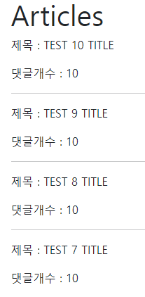
- SQL의 GROUP BY절을 활용
- 원인 : 각 게시글 별 댓글 개수를 반복 평가
- 해결 : annotate를 사용해 첫 조회 시 댓글 개수까지 한번에 조회
    - ```python
        # before
        articles = Article.objects.order_by('-pk')

        # after
        articles = Article.objects.annotate(Count('comment')).order_by('-pk')
      ```
    - ```html
        <!-- before -->
        <p>댓글개수 : {{ article.comment_set.count }}</p>

        <!-- after -->
        <p>댓글개수 : {{ article.comment__count }}</p>
      ```
    - before 
      - 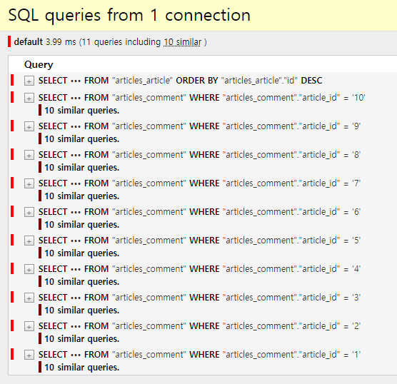
    - after
      - 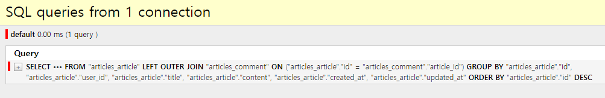

<br/>

### select_related / index 2
- 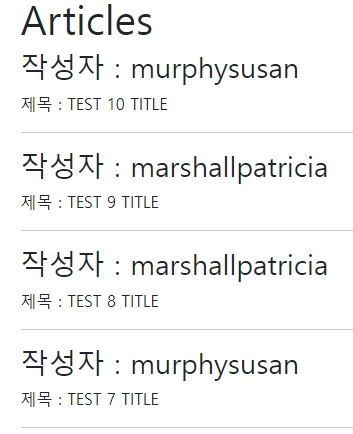
- `1:1` 또는 `N:1`참조 관계에서 사용
- SQL의 INNER JOIN절을 활용
- 원인 : 각 게시글 출력 후 게시글을 작성한 유저의 이름까지 반복 평가
- 해결 : select_related를 사용해 article을 조회하면서 user까지 한번에 조회
    - ```html
        
          <h3>작성자 : {{ article.user.username }}</h3>
          <p>제목 : {{ article.title }}</p>
          <hr>
        
      ```
    - ```python
        # before
        articles = Article.objects.order_by('-pk')

        # after
        articles = Article.objects.select_related('user').order_by('-pk')
      ```
    - before
      - 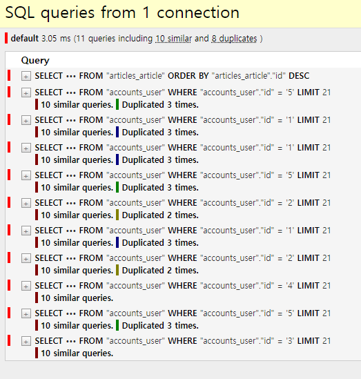
    - after
      - 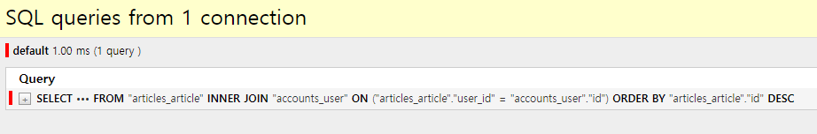

<br/>

### prefetch_related / index 3
- 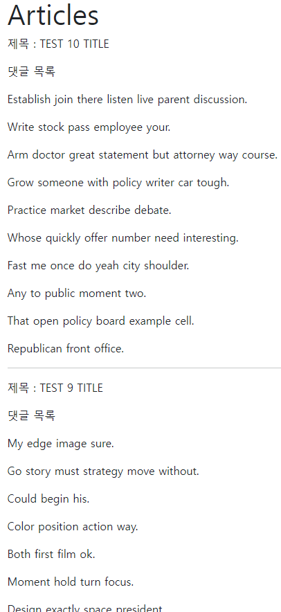
- `M:N`또는 `N:1`역참조 관계에서 사용
- SQL이 아닌 Python을 사용한 JOIN이 진행됨
- 원인 : 각 게시글 출력 후 각 게시글의 댓글 목록을 개별적으로 모두 조회
- 해결 : prefetch_related를 사용해 article을 조회하면서 comment까지 한번에 조회
    - ```html
        
          <p>제목 : {{ article.title }}</p>
          <p>댓글 목록</p>
          
            <p>{{ comment.content }}</p>
          
          <hr>
        
      ```
    - ```python
        # before
        articles = Article.objects.order_by('-pk')

        # after
        articles = Article.objects.prefetch_related('comment_set').order_by('-pk')
      ```
    - before
      - 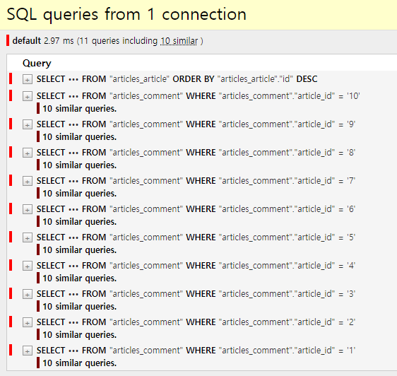
    - after
      - 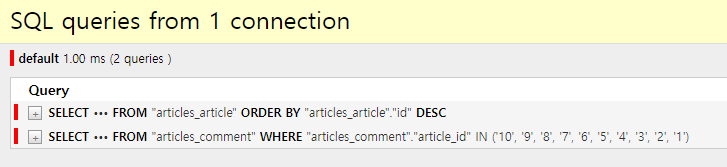

<br/>

### select_related & prefetch_related / index 4
- 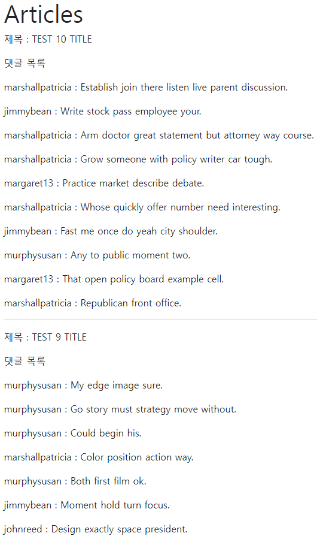
- 원인 : 게시글 출력 + 각 게시글의 댓글 목록 + 댓글의 작성자를 단계적으로 평가
- 해결 : 게시글 출력 + 각 게시글의 댓글 목록 + 댓글의 작성자를 한번에 조회
    - ```html
        
          <p>제목 : {{ article.title }}</p>
          <p>댓글 목록</p>
          
            <p>{{ comment.user.username }} : {{ comment.content }}</p>
          
          <hr>
        
      ```
    - ```python
        # before
        articles = Article.objects.order_by('-pk')

        # after 1
        articles = Article.objects.prefetch_related('comment_set').order_by('-pk')

        # after 2
        articles = Article.objects.prefetch_related(
            Prefetch('comment_set', queryset=Comment.objects.select_related('user'))
        ).order_by('-pk')
      ```
    - before
      - 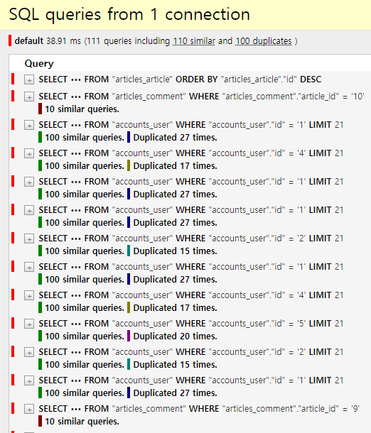
    - after
      - 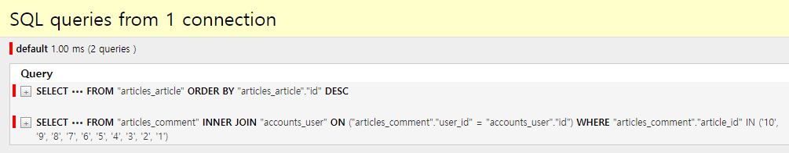

<br/>

## 참고
- 섣부른 최적화는 독이 됨
  - 현재의 수준에서는 위의 내용들을 참고만 하고 효율을 따져야 될 시기에 사용
