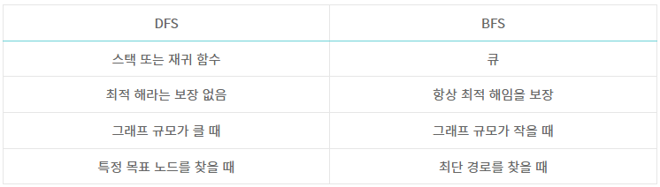

# Tip

 

## DFS

 

### DFS 장점
- 현 경로상의 노드를 기억하기 때문에 `적은 메모리`를 사용
- 찾으려는 노드가 `깊은 단계`에 있는 경우 BFS보다 빠름

 

### DFS 단점
- 해가 없는 경로를 탐색할 경우 단계가 `끝날 때까지 탐색`
- 해에 도착하면 탐색을 종료하기 때문에 얻은 해가 `최단 경로`라는 보장이 없음

 

### DFS 사용 예
- `전체 탐색`을 원할 때
- 특정 영역/깊이까지 가고싶을 때 `임의 깊이`를 정할 수 있음(ex 26169세 번 이내에 사과를 먹자)
- 구분되는 영역 문제
- 조합, 순열, 구현

 

## BFS

 

### BFS 장점
- 답이 되는 경로가 여러 개인 경우에도 `최단 경로`를 보장
- 최단 경로가 존재하면 깊이가 무한정 깊어진다고 해도 답을 찾을 수 있음

 

### BFS 단점
- 경로가 매우 길 경우에는 탐색 가지가 급격히 증가해 `많은 기억 공간`이 필요
- 해가 존재 하지 않으면 모든 그래프를 탐색한 후에 `실패`로 끝남

 

### BFS 사용 예
- `최단 거리` 문제
- 인접한 부분 `가중치`가 붙는 문제 (ex 토마토)

 

## 정리
