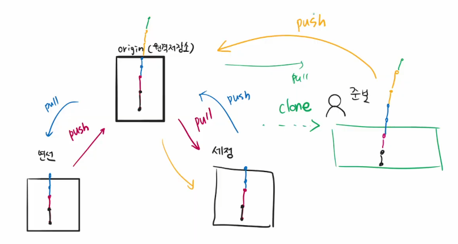

# 원격 저장소

- VS Code = 로컬 저장소 , Github = 원격 저장소

<br/>

## 원격 저장소 설정방법

<br/>

1. `github`에서 `New Repository` 생성
2. 원격 저장소 `정보` 설정
3. 원격 저장소의 `URL` 확인 및 복사
4. `로컬 저장소`에 원격 저장소 정보 설정 

    (git remote add origin https://github.com/UserName/RepositoryName.git)
5. `원격 저장소`의 정보를 확인

    (git remote -v)

<br/>

## GitHub 기반 원격 저장소 활용

<br/>

- ### **`git push (원격 저장소 이름) (브랜치 이름)`**


```
git push origin master

원격 저장소로 로컬 저장소 변경 사항(커밋)을 올림(push)
- 처음할 때 계정 인증 필요
```


- ### **`git pull (원격 저장소 이름) (브랜치 이름)`**

```
git pull origin master

원격 저장소로부터 변경된 내역을 받아와서 이력을 병합함
```


- ### **`git clone (원격 저장소 주소)`**

```
git clone URL

원격 저장소를 복제하여 가져옴
- git init = 로컬에서의 프로젝트 시작
  git clone = 원격에 있는 프로젝트 시작
```


- ### **`Push Conflict`**

```
- 로컬과 원격 저장소의 commit 이력이 다른 경우 발생

1. 원격저장소의 commit을 원격 저장소로 가져온다 (pull)
2. 로컬에서 두 커밋을 병합 (추가 commit 발생)
3. 다시 GitHub로 Push