# 다양한 동적 계획법 문제 풀이

<br/>

## 이코테 개미 전사
- 개미 전사는 부족한 식량을 충당하고자 메뚜기 마을의 식량창고를 몰래 공격하려고 합니다. 메뚜기 마을에는 여러 개의 식량창고가 있는데 식량창고는 일직선으로 이어져 있습니다.
- 각 식량창고에는 정해진 수의 식량을 저장하고 있으며 개미 전사는 식량창고를 선택적으로 약탈하여 식량을 빼앗을 예정입니다. 이때 메뚜기 정찰병들은 일직선상에 존재하는 식량창고 중에서 서로 인접한 식량창고가 공격받으면 바로 알아챌 수 있습니다.
- 따라서 개미 전사가 정찰병에게 들키지 않고 식량창고를 약탈하기 위해서는 최소한 한 칸 이상 떨어진 식량창고를 약탈해야 합니다.
- |창고 0|창고 1|창고 2|창고 3|
  |--|--|--|--|
  |1|3|1|5|
- 이때 개미 전사는 두 번째 식량창고와 네 번째 식량창고를 선택했을 때 최댓값인 총 8개의 식량을 빼앗을 수 있습니다. 개미 전사는 식량창고가 이렇게 일직선상일 때 최대한 많은 식량을 얻기를 원합니다.
- 개미 전사를 위해 식량창고 N개에 대한 정보가 주어졌을 때 얻을 수 있는 식량의 최댓값을 구하는 프로그램을 작성하세요.

<br/>

### 문제 조건
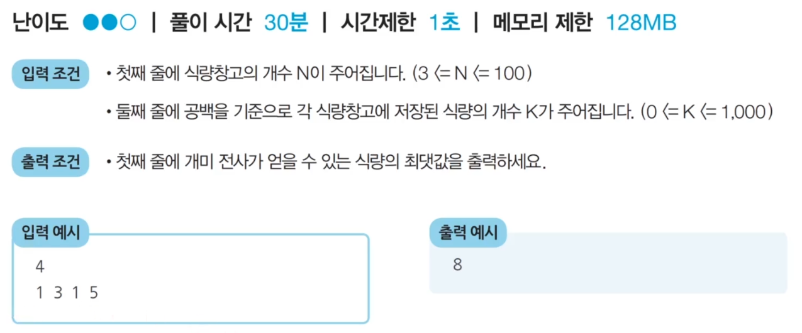

<br/>

### 문제 해결 아이디어
- N = 4일 때, 다음과 같은 경우들이 존재
  - 식량을 선택할 수 있는 경우의 수는 다음과 같이 8가지
  - 7번째 경우에서 8만큼의 식량을 얻을 수 있으므로 최적의 해는 8
  - 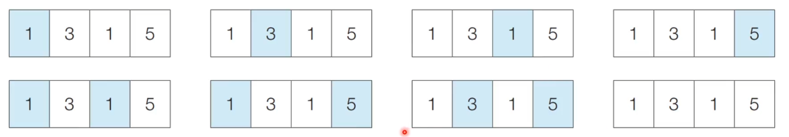
- a_i = i번째 식량창고까지의 최적의 해(얻을 수 있는 식량의 최댓값)
  - 이렇게 정의한다면 다이나믹 프로그래밍 적용 가능
  - a_0 = 1 / a_1 = 3 / a_2 = 3 / a_3 = 8
- 왼쪽부터 차례대로 식량창고를 턴다고 했을 때, 특정한 i번째 식량창고에 대해서 털지 안 털지의 여부를 결정하면, 아래 2가지 경우 중에서 더 많은 식량을 털 수 있는 경우를 선택
- a_i = i번째 식량창고까지의 최적의 해(얻을 수 있는 식량의 최댓값)
- k_i = i번째 식량창고에 있는 식량의 양
- 점화식 : a_i = max(a_i-1, a_i-2 + k_i)
- 한 칸 이상 떨어진 식량창고는 항상 털 수 있으므로 (i-3)번째 이하는 고려할 필요가 없음

<br/>

### 답안 코드
```python
# 정수 N을 입력
n = int(input())
# 모든 식량 정보 입력
g = list(map(int,input().split()))

# 앞서 계산된 결과를 저장하기 위한 DP 테이블 초기화
d = [0] * 100

# 다이나믹 프로그래밍 진행(보텀업)
d[0] = g[0]
d[1] = max(g[0], g[1])
for i in range(2, n):
  d[i] = max(d[i-1], d[i-2] + g[i])

print(d[n-1])
```

<br/>

## 이코테 1로 만들기
- 정수 X가 주어졌을 때, 정수 X에 사용할 수 있는 연산은 다음과 같이 4가지
  - X가 5로 나누어 떨어지면, 5로 나눈다.
  - X가 3으로 나누어 떨어지면, 3으로 나눈다.
  - X가 2로 나누어 떨어지면, 2로 나눈다.
  - X에서 1을 뺀다.
- 정수 X가 주어졌을 때, 연산 4개를 적절히 사용해서 값을 1로 만들고자 한다. 연산을 사용하는 횟수의 최솟값을 출력하세요. 예를 들어 정수가 26이면 다음과 같이 계산해서 3번의 연산이 최솟값
  - 26 => 25 => 5 => 1

<br/>

### 문제 조건
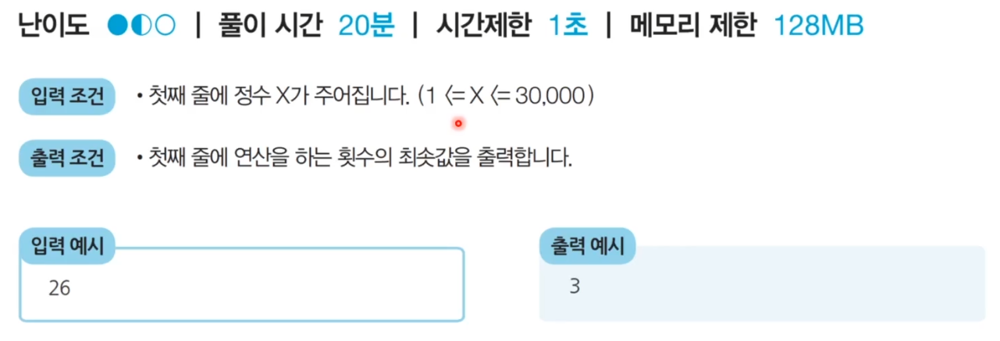

<br/>

### 문제 해결 아이디어
- 피보나치 수열 문제를 도식화한 것처럼 함수가 호출되는 과정을 그림으로 그려보면 다음과 같음
  - 최적 부분 구조와 중복되는 부분 문제를 만족
  - 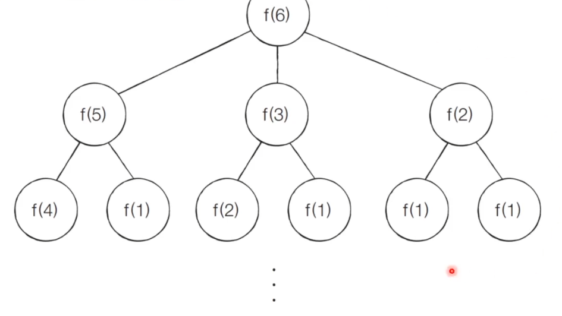
- a_i = i를 1로 만들기 위한 최소 연산 횟수
- 점화식 : a_i = min(a_i-1, a_i/2, a_i/3, a_i/5) + 1
- 단, 1을 빼는 연산을 제외하고는 해당 수로 나누어떨어질 때에 한해 점화식 적용 가능

<br/>

### 답안 코드
```python
# 정수 X를 입력
x = int(input())

# 앞서 계산된 결과를 저장하기 위한 DP 테이블 초기화
d = [0] * 30001

# 다이나믹 프로그래밍 진행(보텀업)
for i in range(2, x+1):
  # 현재의 수에서 1을 빼는 경우
  d[i] = d[i-1] + 1
  # 현재의 수가 2로 나누어 떨어지는 경우
  if i % 2 == 0:
    d[i] = min(d[i], d[i//2] + 1)
  # 현재의 수가 3으로 나누어 떨어지는 경우
  if i % 3 == 0:
    d[i] = min(d[i], d[i//3] + 1)
  # 현재의 수가 5로 나누어 떨어지는 경우
  if i % 5 == 0:
    d[i] = min(d[i], d[i//5] + 1)

print(d[x])
```

## 이코테 효율적인 화폐 구성
- N가지 종류의 화폐가 있다. 이 화폐들의 개수를 최소한으로 이용해서 그 가치의 합이 M원이 되도록 하려고 한다. 이때 각 종류의 화폐는 몇 개라도 사용할 수 있다.
- 예를 들어 2원, 3원 단위의 화폐가 있을 때는 15원을 만들기 위해 3원을 5개 사용하는 것이 가장 최소한의 화폐 개수이다.
- M원이 만들기 위한 최소한의 화폐 개수를 출력하는 프로그램을 작성

<br/>

### 문제 조건


<br/>

### 문제 해결 아이디어
- a_i = 금액 i를 만들 수 있는 최소한의 화폐 개수
- k = 각 화폐의 단위
- 점화식 : 각 화폐 단위인 k를 하나씩 확인하며
  - a_i-k를 만드는 방법이 존재하는 경우, a_i = min(a_i, a_i-k + 1)
  - a_i-k를 만드는 방법이 존재하지 않는 경우, a_i = INF
- N = 3, M = 7이고, 각 화폐의 단위가 2, 3, 5인 경우
- step 0 / 초기화
  - 먼저 각 인덱스에 해당하는 값으로 INF(무한)의 값을 설정
  - INF은 특정 금액을 만들 수 있는 화폐 구성이 가능하지 않다는 의미
  - 본 문제에서는 10,001을 사용 가능
- step 1
  - 첫 번째 화폐 단위인 2를 확인
  - 점화식에 따라서 다음과 같이 리스트를 갱신
  - 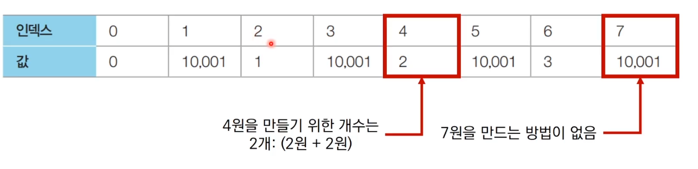
- step 2
  - 두 번째 화폐 단위인 3을 확인
  - 점화식에 따라서 다음과 같이 리스트가 갱신
  - 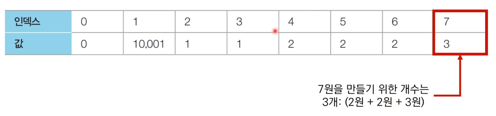
- step 3
  - 세 번째 화폐 단위인 5를 확인
  - 점화식에 따라서 다음과 같이 최종적으로 리스트가 갱신
  - 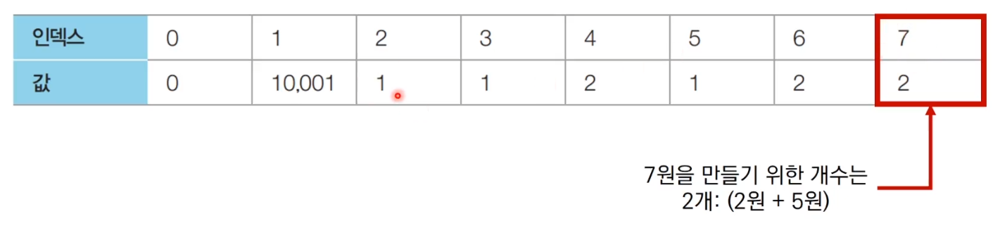

<br/>

### 답안 코드
```python
# 정수 N, M을 입력 받기
n, m = map(int,input().split())
# N개의 화폐 단위 정보를 입력
g = []
for i in range(n):
  g.append(int(input()))

# 한 번 계산된 결과를 저장하기 위한 DP 테이블 초기화
d = [10001] * (m+1)

# 다이나믹 프로그래밍 진행 (보텀업)
d[0] = 0
for i in range(n):
  for j in range(g[i], m+1):
    if d[j-g[i]] != 10001: # (i - k)원을 만드는 방법이 존재하는 경우
      d[j] = min(d[j], d[j-g[i]] + 1)

# 계산된 결과 출력
if d[m] == 10001: # 최종적으로 M원을 만드는 방법이 없는 경우
  print(-1)
else:
  print(d[m])
```

<br/>

## 금광
- n x m 크기의 금광이 있다. 금광은 1 x 1 크기의 칸으로 나누어져 있으며, 각 칸은 특정한 크기의 금이 들어 있다.
- 채굴자는 첫 번째 열부터 출발하여 금을 캐기 시작한다. 맨 처음에는 첫 번쟤 열의 어느 행에서든 출발할 수 있다. 이후에 m-1번에 걸쳐서 매번 오른쪽 위, 오른쪽, 오른쪽 아래 3가지 중 하나의 위치로 이동해야 한다. 결과적으로 채굴자가 얻을 수 있는 금의 최대 크기를 출력하는 프로그램을 작성
- 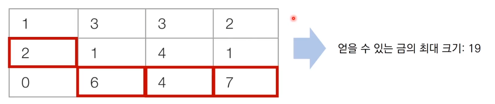

<br/>

### 문제 조건
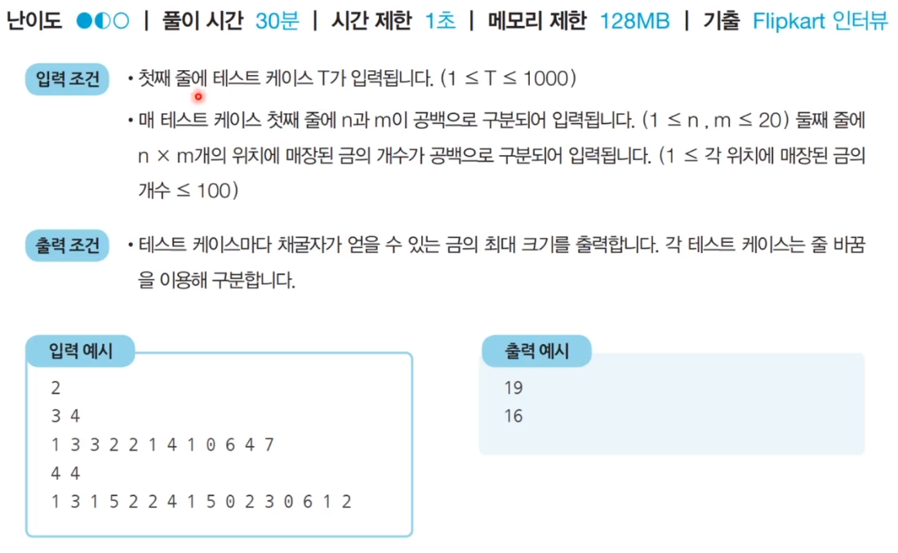

<br/>

### 문제 해결 아이디어
- 세가지만 고려
  - 왼쪽 위에서 오는 경우
  - 왼쪽 아래에서 오는 경우
  - 왼쪽에서 오는 경우
- 세가지 경우 중에서 가장 많은 금을 가지고 있는 경우를 테이블에 갱신해주어 문제를 해결
- g[i][j] = i행 j열에 존재하는 금의 양
- dp[i][j] = i행 j열까지의 최적의 해(얻을 수 있는 금의 최댓값)
- 점화식 : dp[i][j] = g[i][j] + max(dp[i-1][j-1], dp[i][j-1], dp[i+1][j-1])
- 이 때 테이블에 접근할 때마다 리스트의 범위를 벗어나지 않는지 체크해야 함
- 편의상 초기 데이터를 담는 변수 g를 사용하지 않아도 됨
  - 바로 DP 테이블에 초기 데이터를 담아서 다이나믹 프로그래밍을 적용 가능
- DP 해결 과정
  - 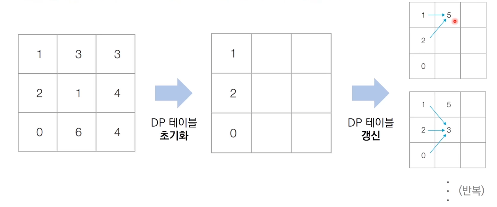

<br/>

### 답안 코드
```python
# 테스트 케이스 입력
for tc in range(int(input())):
  # 금광 정보 입력
  n, m = map(int,input().split())
  g = list(map(int,input().split()))
  # 다이나믹 프로그래밍을 위한 2차원 DP 테이블 초기화
  dp = []
  index = 0
  for i in range(n):
    dp.append(g[index:index+m])
    index += m
  # 다이나믹 프로그래밍 진행
  for j in range(1, m):
    for i in range(n):
      # 왼쪽 위에서 오는 경우
      if i == 0: left_up = 0
      else: left_up = dp[i+1][j-1]
      # 왼쪽 아래에서 오는 경우
      if i == n-1: left_down = 0
      else: left_down = dp[i+1][j-1]
      # 왼쪽에서 오는 경우
      left = dp[i][j-1]
      dp[i][j] = dp[i][j] + max(left_up, left_down, left)
  result = 0
  for i in range(n):
    result = max(result, dp[i][m-1])
  print(result)
```

<br/>

## 병사 배치하기
- N명의 병사가 무작위로 나열되어 있다. 각 병사는 특정한 값의 전투력을 보유하고 있다.
- 병사를 배치할 때는 전투력이 높은 병사가 앞쪽에 오도록 내림차순으로 배치를 하고자 한다. 다시 말해 앞쪽에 있는 병사의 전투력이 항상 뒤쪽에 있는 병사보다 높아야 함
- 또한 배치 과정에서는 특정한 위치에 있는 병사를 열외시키는 방법을 이용한다. 그러면서도 남아 있는 병사의 수가 최대가 되도록 하고 싶다.
- 예를 들어, N = 7일 때 나열된 병사들의 전투력이 다음과 같다고 가정
- 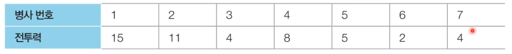
- 이때 3번 병사와 6번 병사를 열외시키면, 다음과 같이 남아 있는 병사의 수가 내림차순의 형태가 되며 5명이 된다. 이는 남아 있는 병사의 수가 최대가 되도록 하는 방법이다.
- 
- 병사에 대한 정보가 주어졌을 때, 남아 있는 병사의 수가 최대가 되도록 하기 위해서 열외시켜야 하는 병사의 수를 출력하는 프로그램을 작성

<br/>

### 문제 조건


<br/>

### 문제 해결 아이디어
- 이 문제의 기본 아이디어는 가장 긴 증가하는 부분 수열(LIS)로 알려진 전형적인 다이나믹 프로그래밍 문제
- 예를 들어 하나의 수열 g = {4,2,5,8,4,11,15}
  - 이 수열의 가장 긴 증가하는 부분 수열 {4,5,8,11,15}
- 본 문제는 가장 긴 감소하는 부분 수열을 찾는 문제로 치환할 수 있으므로, LIS 알고리즘을 조금 수정하여 적용함으로써 정답을 도출 가능
- 가장 긴 증가하는 부분 수열 알고리즘
  - D[i] = g[i]를 마지막 원소로 가지는 부분 수열의 최대 길이
  - 점화식 : 모든 0 <= j < i에 대하여, D[i] = max(D[i], D[j] + 1) if g[j] < g[i]
  - 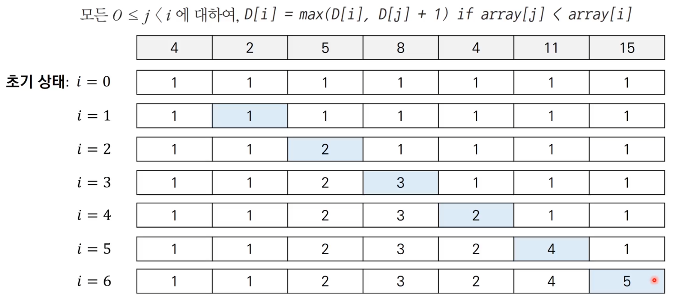

<br/>

### 답안 코드
```python
n = int(input())
g = list(map(int,input().split()))
# 순서를 뒤집어 '최장 증가 부분 수열' 문제로 변환
g.reverse()

# 다이나믹 프로그래밍을 위한 1차원 DP 테이블 초기화
dp = [1] * n

# 가장 긴 증가하는 부분 수열(LIS) 알고리즘 수행
for i in range(1, n):
  for j in range(0, i):
    if g[j] < g[i]:
      dp[i] = max(dp[i], dp[j] + 1)

# 열외해야 하는 병사의 최소 수를 출력
print(n-max(dp))
```
